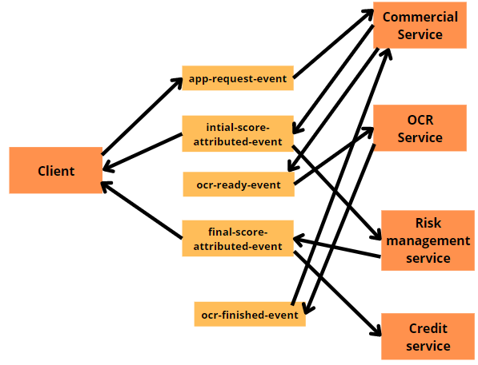
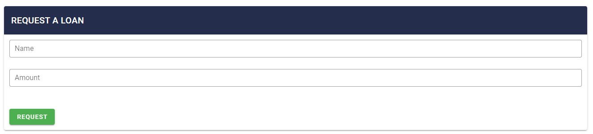

# ArchiTP4-Microservice-nestjs
## Microservices

Microservices - also known as the microservice architecture - is an architectural style that structures an application as a collection of services that are

- Highly maintainable and testable
- Loosely coupled
- Independently deployable
- Organized around business capabilities
- Owned by a small team

The microservice architecture enables the rapid, frequent and reliable delivery of large, complex applications. It also enables an organization to evolve its technology stack.

## Message Broker

Message brokers are programs that enables services to communicate with each other and exchange information. If you already know about APIs, you may think that message brokers are same as APIs. But it’s not, the message broker usually does this by implementing a queue, that the different services can write to or read from. So, this will allow these services to asynchronously communicate with each other, even if they were written in different languages or implemented on different platforms.

So, these message brokers behave as a bridge between applications, allowing senders to publish messages without knowing where the receivers are or how many of them there are

### Basic components of Message Broker

There are 4 components in message brokers that you need to know.

Producer — This is the endpoint which sends any kind of data, that is stored inside the message broker to distribute.
Consumer — This is the endpoint which asks from the message broker for messages and consume it.
Queue — This is a data type which the message broker use to store messages inside, with the logic of FIFO(First in First out). Queues stores the messages until a consuming service processes them. These queues also allow asynchronous type of programming, since the queues are the ones responsible for delivering the messages, the sender can continue performing different tasks.
Exchanger — This is known as a logical configuration or even entity, on top of the queues, which tells the message broker to create some sort of a group, which a consumers can listen to the receiving messages or producers can write to send messages.

## Architecture Implemented
In this project we have implemented multiple MicroServices that simulates the Credit Procedure from a bank. The microservices communicates with each others via
a Redis Broker. Each MicroService is connected to the topic that he is conserned like the architecture shown below.

## Implementation

